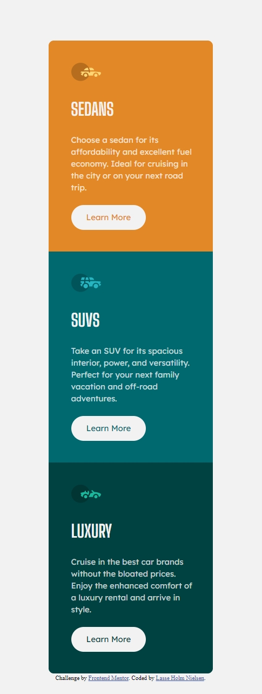
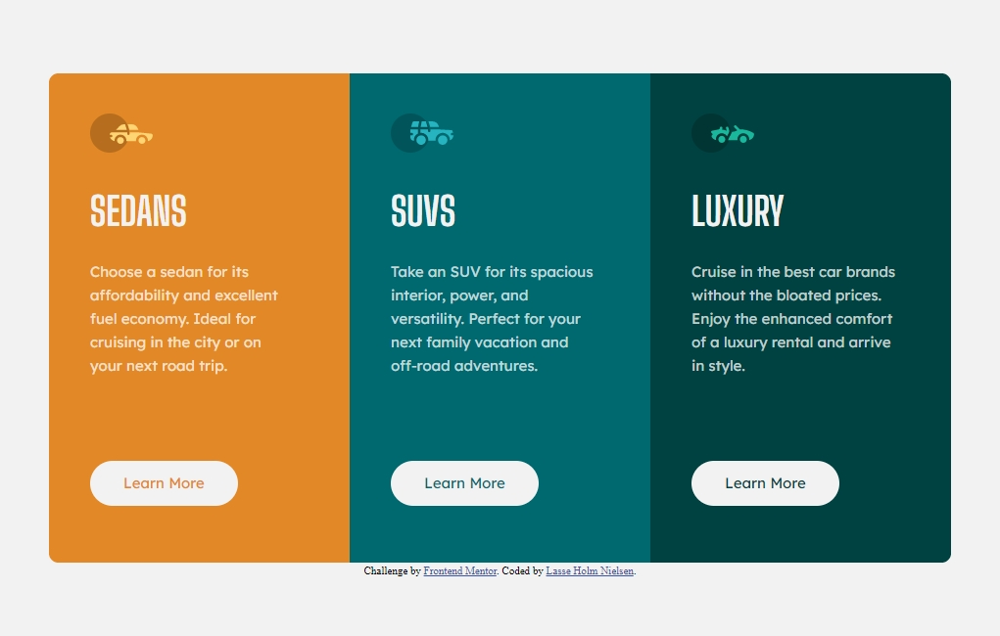

# Frontend Mentor - 3-column preview card component solution

This is a solution to the [3-column preview card component challenge on Frontend Mentor](https://www.frontendmentor.io/challenges/3column-preview-card-component-pH92eAR2-). Frontend Mentor challenges help you improve your coding skills by building realistic projects. 

## Table of contents

- [Overview](#overview)
  - [The challenge](#the-challenge)
  - [Screenshot](#screenshot)
  - [Links](#links)
- [My process](#my-process)
  - [Built with](#built-with)
  - [What I learned](#what-i-learned)
  - [Useful resources](#useful-resources)
- [Author](#author)

## Overview

### The challenge

Users should be able to:

- View the optimal layout depending on their device's screen size
- See hover states for interactive elements

### Screenshot

### Links

- Solution URL: [Final Solution](https://github.com/Kanonkongen-dk/3-column-preview-card-component-main)
- Live Site URL: [GitHub Live Site](https://kanonkongen-dk.github.io/3-column-preview-card-component-main/)

## My process

### Built with

- Semantic HTML5 markup
- SASS / SCSS
- Flexbox
- Mobile-first workflow

### What I learned

With this project I aimed at getting up to speed with SASS again. Have used it a little in the past, but needed to get into it again. That also gave me the opportunity to catch up with the lattest in Dart SASS. Especially using @use and @forward instead of @import, and the namespacing it brings with it.

### Useful resources

- [Kevin Powell's YouTube Channel](https://www.youtube.com/kepowob) - Kevin Powell is a great resource for HTML and CSS. For this project I watched a couple of his videos about SASS, to brush up a little.

## Author

- Frontend Mentor - [@Kanonkongen-dk](https://www.frontendmentor.io/profile/Kanonkongen-dk)